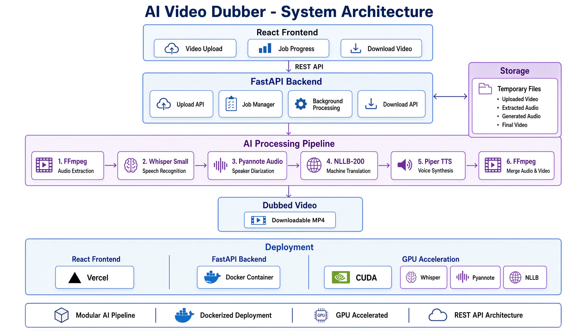

# System Architecture

The following diagram provides a high-level overview of the AI Video Dubber architecture, illustrating the interaction between the frontend, backend, AI processing pipeline, storage, deployment environment, and GPU-accelerated components.

<p align="center">
  
</p>

---

## Overview

The application follows a client-server architecture where the frontend is responsible for user interaction while the backend orchestrates the AI pipeline responsible for speech recognition, translation, speaker diarization, speech synthesis, and video generation.

The system has been designed with modularity in mind so that each AI component can be replaced independently without affecting the overall pipeline.

---

# High Level Architecture


---

# Components

## Frontend

The frontend is built using React and TypeScript.

Responsibilities:

- Upload videos
- Display processing status
- Poll job progress
- Download completed videos

---

## Backend

The backend is implemented using FastAPI.

Responsibilities:

- Receive uploaded videos
- Manage processing jobs
- Execute the AI pipeline
- Serve processed videos
- Expose REST APIs

---

# AI Pipeline

Every uploaded video passes through the following stages.

## 1. Audio Extraction

FFmpeg extracts the audio track from the uploaded video.

Output:

- WAV audio

---

## 2. Speaker Diarization

Pyannote Audio identifies speaker boundaries and assigns a speaker label to each segment.

Output:

```
Speaker A
Speaker B
Speaker A
...
```

---

## 3. Speech Recognition

Whisper Small converts speech into text.

Output:

```
Original transcription
```

---

## 4. Translation

Facebook NLLB translates the transcription into the selected target language.

Output:

```
Translated transcription
```

---

## 5. Speech Synthesis

Piper TTS generates natural speech for each translated segment.

Output:

```
Translated speech
```

---

## 6. Audio Synchronization

Generated speech segments are aligned according to the timestamps produced during transcription and diarization.

---

## 7. Video Rendering

FFmpeg combines the synthesized audio with the original video to produce the final dubbed output.

---

# Deployment

The application is containerized using Docker.

The frontend is deployed separately from the backend.

```
React (Vercel)

↓

Cloudflare Tunnel

↓

FastAPI (Docker)

↓

GPU
```

---

# Advantages

- Modular architecture
- GPU acceleration
- Docker deployment
- Easy model replacement
- REST API based communication